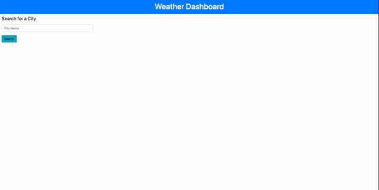
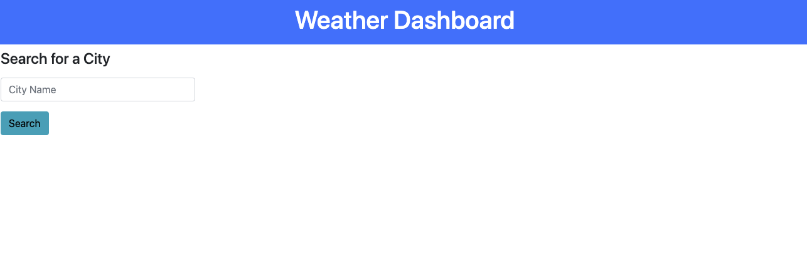

# Weather-Dashboard

## Technology Used 

| Technology Used         | Resource URL           | 
| ------------- |:-------------:| 
| HTML    | [https://developer.mozilla.org/en-US/docs/Web/HTML](https://developer.mozilla.org/en-US/docs/Web/HTML) | 
| CSS     | [https://developer.mozilla.org/en-US/docs/Web/CSS](https://developer.mozilla.org/en-US/docs/Web/CSS)      |   
| Git | [https://git-scm.com/](https://git-scm.com/)     |    
| JavaScript     | [https://developer.mozilla.org/en-US/docs/Web/JavaScript](https://developer.mozilla.org/en-US/docs/Web/JavaScript)      |   
| Bootstrap     | [https://getbootstrap.com/docs/5.1/getting-started/introduction/](https://getbootstrap.com/docs/5.1/getting-started/introduction/)      |   


## Description 

[Visit the Deployed Site](https://famelga.github.io/Weather-Dashboard/)

I have used a third-party API to retrieve data from openweathermap.org to create a weather dashboard.

Before using the API, I needed to set up my html framework. I created a header and search tools on the body. I included the search text box and button, along with their subheading in a div tag. This div tag allowed for all of the children to be formatted together at the upper-left hand corner for the main body. These were styled directly in the html using Bootstrap, rather than in the style.css document. I also included div tags as placeholders for where the returned responses from the API would be displayed on the html.

In JavaScript, I created an eventlistener for the search button. This eventlistener triggers a series of functions that work to retrieve the necessary data from the API. I console.logged the returned data, then traversed the console to call on the data that was retrieved from the API. I attempted to include this data on by html by using textContent and appendChild. While some of the data displayed onto the website, I received an error message stating that the data was not recognized. 



## Portfolio Example

Here is an example of the code I used to extract the data in the console that was received from the API.

```
    var todayEl = document.getElementById("today");
    var nameEl = document.createElement("h2");
    nameEl.textContent = data.name;
    todayEl.appendChild(nameEl);
```
This is where I wanted to place the data on the html.
```
<div id="today" class="current-date"></div>
```

## Usage 

Visit website.




## Learning Points 


While I struggled with displaying the response from the API, I learned the proper format to fetch an APi and its promise. I was also able to successfully use bootstrap to style my html without css.

## Author Info

### Fayven Amelga 


* [Portfolio](https://famelga.github.io/Portfolio/)
* [LinkedIn](https://www.linkedin.com/in/fayven-amelga-b09b17b6/)
* [Github](https://github.com/famelga)


## Credits

Fayven Amelga


## License

MIT License

Copyright (c) 2023 Fayven Amelga

Permission is hereby granted, free of charge, to any person obtaining a copy
of this software and associated documentation files (the "Software"), to deal
in the Software without restriction, including without limitation the rights
to use, copy, modify, merge, publish, distribute, sublicense, and/or sell
copies of the Software, and to permit persons to whom the Software is
furnished to do so, subject to the following conditions:

The above copyright notice and this permission notice shall be included in all
copies or substantial portions of the Software.

THE SOFTWARE IS PROVIDED "AS IS", WITHOUT WARRANTY OF ANY KIND, EXPRESS OR
IMPLIED, INCLUDING BUT NOT LIMITED TO THE WARRANTIES OF MERCHANTABILITY,
FITNESS FOR A PARTICULAR PURPOSE AND NONINFRINGEMENT. IN NO EVENT SHALL THE
AUTHORS OR COPYRIGHT HOLDERS BE LIABLE FOR ANY CLAIM, DAMAGES OR OTHER
LIABILITY, WHETHER IN AN ACTION OF CONTRACT, TORT OR OTHERWISE, ARISING FROM,
OUT OF OR IN CONNECTION WITH THE SOFTWARE OR THE USE OR OTHER DEALINGS IN THE
SOFTWARE.

## Badges


---

© 2023 Trilogy Education Services, LLC, a 2U, Inc. brand. Confidential and Proprietary. All Rights Reserved.